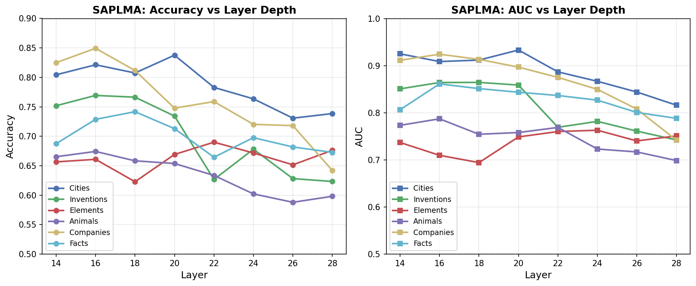
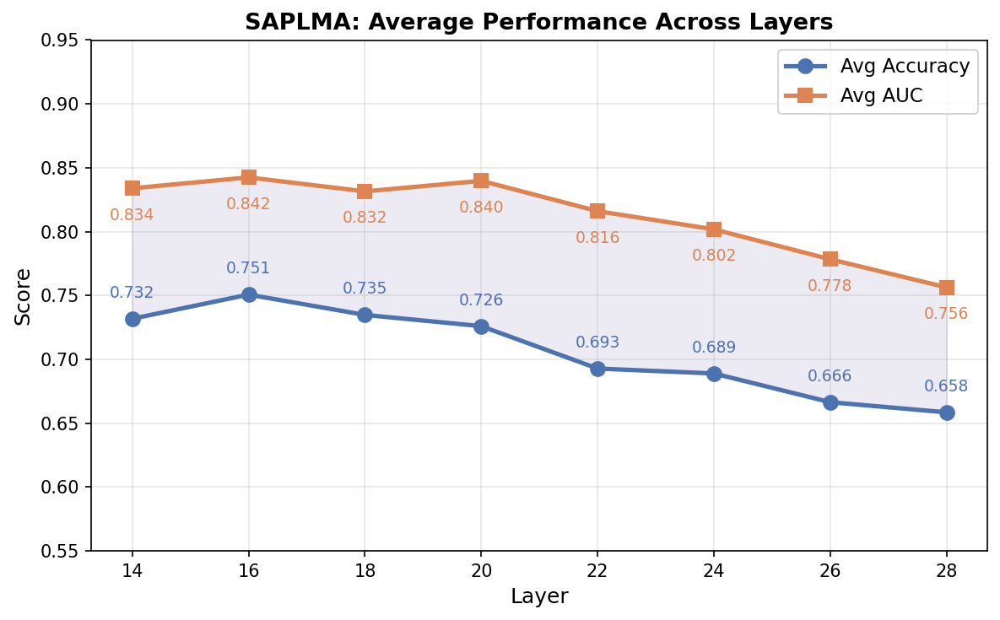
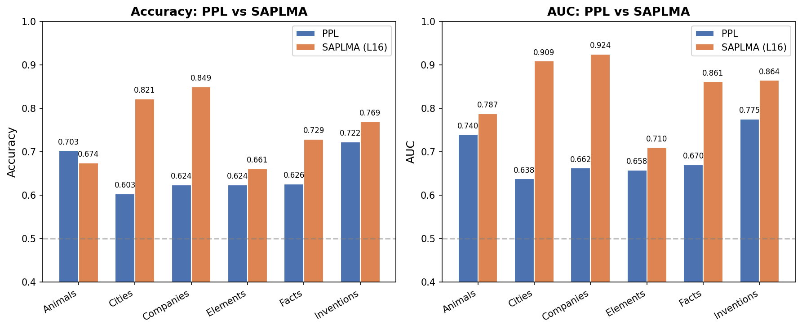
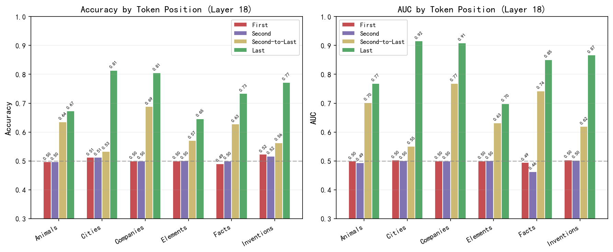
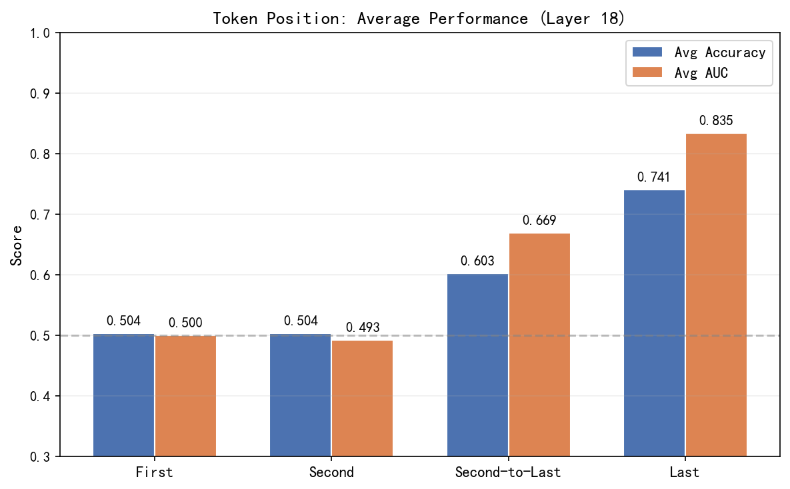

# 中期进度汇报：利用大语言模型内部状态进行幻觉检测

**课程**：自然语言处理

**小组成员**：陆亭羽（231880506）、刘圣文（231880321）

**日期**：2026年5月25日

---

## 一、项目概述

### 1.1 研究背景

大语言模型在各项NLP任务中展现了强大能力，但其生成包含事实错误的"幻觉"文本并伴随高置信度语气的缺陷仍然显著。基于内部状态的幻觉检测无需依赖外部知识库检索，仅利用模型自身的隐性认知状态即可判断生成内容的真实性，具有低延迟和广泛适用性的优势。

### 1.2 研究目标

1. 复现并对比基于语句生成概率（PPL）的方法与基于隐藏层分类的SAPLMA方法在幻觉检测任务上的表现；
2. 探索大语言模型不同层、不同token位置的隐藏层特征质量对分类性能的影响；
3. （进阶）探索基于注意力模式或FFN知识熵等机制的改进幻觉检测方法。

### 1.3 实验设置

| 项目 | 说明 |
|------|------|
| 基座模型 | Qwen2-1.5B（28层Transformer） |
| 数据集 | True-False Dataset（Cities, Inventions, Elements, Animals, Companies, Facts 六个子领域） |
| SAPLMA探测层 | 第14、18、22、26、28层（从中间层到最后一层，每4层采样） |
| Token位置实验 | Layer 18，位置：First、Second、Second-to-Last、Last |
| 交叉验证 | Leave-one-out（5个主题训练，1个主题测试） |
| 随机重启 | 每组实验3次，取平均 |
| 探测器架构 | 3层前馈网络（256→128→64→1），ReLU激活，Sigmoid输出 |

---

## 二、已完成工作

### 2.1 阶段一：基础任务（已完成）

#### 2.1.1 基于PPL的幻觉检测

**方法**：计算每个陈述的负对数似然（NLL），NLL越高表示模型越认为该陈述"不可能"，即更可能是幻觉。通过ROC曲线搜索最优阈值进行二分类。

**实验结果**：

| 数据集 | Accuracy | AUC | 最优阈值 |
|--------|----------|-----|----------|
| Cities | 0.7025 | 0.7395 | 3.969 |
| Inventions | 0.6027 | 0.6377 | 5.233 |
| Elements | 0.6237 | 0.6624 | 3.304 |
| Animals | 0.6240 | 0.6579 | 4.318 |
| Companies | 0.6258 | 0.6697 | 4.041 |
| Facts | 0.7222 | 0.7750 | 2.961 |

**分析**：PPL方法在Facts和Cities数据集上表现较好（AUC > 0.73），但在Inventions上表现最差（AUC = 0.6377），这可能是因为发明相关的陈述涉及更多专业术语和复杂语义，仅靠生成概率难以有效区分真伪。

#### 2.1.2 基于SAPLMA的幻觉检测

**方法**：提取Qwen2-1.5B各层最后一个token的隐藏状态作为嵌入，训练3层前馈网络分类器，采用Leave-one-out交叉验证评估泛化能力。

**各层各主题实验结果**：

| 层 | Cities | Inventions | Elements | Animals | Companies | Facts | **平均** |
|----|--------|------------|----------|---------|-----------|-------|----------|
| 14 | 0.7867 / 0.9192 | 0.7496 / 0.8528 | 0.6459 / 0.7333 | 0.6561 / 0.7726 | 0.8317 / 0.9083 | 0.6661 / 0.8036 | **0.7227 / 0.8317** |
| 18 | 0.8163 / 0.9117 | 0.7713 / 0.8631 | 0.6394 / 0.6976 | 0.6779 / 0.7651 | 0.7917 / 0.9128 | 0.7397 / 0.8528 | **0.7394 / 0.8339** |
| 22 | 0.7973 / 0.9030 | 0.6301 / 0.7746 | 0.6849 / 0.7741 | 0.6147 / 0.7746 | 0.7389 / 0.8775 | 0.7053 / 0.8340 | **0.6952 / 0.8230** |
| 26 | 0.7520 / 0.8640 | 0.6396 / 0.7864 | 0.6746 / 0.7675 | 0.5761 / 0.7047 | 0.7086 / 0.8233 | 0.7070 / 0.8164 | **0.6763 / 0.7937** |
| 28 | 0.7428 / 0.8376 | 0.6271 / 0.7426 | 0.6452 / 0.7497 | 0.6134 / 0.6976 | 0.6494 / 0.7423 | 0.6596 / 0.7980 | **0.6563 / 0.7613** |

> 表中数据格式为 Accuracy / AUC

**层深度与性能关系**（见下图）：

**分析**：SAPLMA方法的性能随层深度呈现明显的倒U型趋势——**第18层（中间偏后）取得最优平均性能**（Accuracy=0.7394, AUC=0.8339），而最后一层（第28层）反而表现最差。这与SAPLMA论文的发现一致：中间偏后层的隐藏状态包含最丰富的真伪判别信息，而靠近输出的层可能已被"解码"为生成目标，丢失了部分内部认知信号。

#### 2.1.3 PPL vs SAPLMA对比

| 方法 | 平均Accuracy | 平均AUC | 最优主题 | 最弱主题 |
|------|-------------|---------|----------|----------|
| PPL | 0.6502 | 0.6904 | Facts (0.7222) | Inventions (0.6027) |
| SAPLMA (L18) | **0.7394** | **0.8339** | Cities (0.8163) | Elements (0.6394) |

**SAPLMA方法显著优于PPL方法**，平均AUC提升约0.14。这表明模型的内部隐藏状态比生成概率包含了更丰富、更本质的真伪判别信息，且受表面特征（词频、句长等）干扰更小。

---

### 2.2 阶段二：分析任务（已完成）

#### 2.2.1 PPL与SAPLMA性能差异分析

**SAPLMA更有效的原因分析**：

1. **信息丰富度**：PPL仅利用一个标量值（NLL），而SAPLMA利用高维隐藏状态向量（Qwen2-1.5B为1536维），信息量远大于单一概率值。

2. **抗表面特征干扰**：NLL受词频、句长等表面统计特征影响较大——常见词组合即使事实错误也可能获得较低NLL，而罕见但正确的陈述可能NLL偏高。SAPLMA的隐藏状态编码了更抽象的语义信息，能更好地剥离表面特征的干扰。

3. **非线性判别能力**：PPL方法本质上是线性阈值分类，而SAPLMA的前馈网络探测器具备非线性建模能力，可以学习隐藏状态中更复杂的真伪判别模式。

4. **内部认知信号**：隐藏状态直接反映了模型对输入的内部表征，包含模型"是否知道"该陈述的信息，而NLL仅反映"生成该陈述的难易程度"，两者语义不同。

#### 2.2.2 不同Token位置的内部状态检测性能分析

在Layer 18上，我们对比了四个token位置的隐藏状态对检测性能的影响：

| Token位置 | 平均Accuracy | 平均AUC |
|-----------|-------------|---------|
| First（首token） | 0.5041 | 0.5001 |
| Second（第二token） | 0.5042 | 0.4934 |
| Second-to-Last（倒数第二token） | 0.6031 | 0.6677 |
| **Last（最后token）** | **0.7407** | **0.8350** |

**分析**：

1. **首token和第二token几乎无法检测幻觉**（Accuracy ≈ 0.50，接近随机猜测）。这是因为句首token的隐藏状态尚未充分吸收整个句子的语义信息，模型还未完成对陈述内容的理解。

2. **倒数第二token已有一定检测能力**（AUC = 0.6677），说明随着token位置后移，隐藏状态逐渐积累了更多语义信息。

3. **最后token的检测能力最强**（AUC = 0.8350），与SAPLMA论文的结论一致。最后token的隐藏状态已经"看过"了整个句子，包含了最完整的语义表征和真伪判别信号。这也解释了SAPLMA论文选择最后token作为嵌入的合理性。

4. 从Second-to-Last到Last，AUC从0.6677跃升至0.8350（提升0.1673），说明**最后token的隐藏状态在信息聚合上具有质变性的优势**——它不仅是信息的累积，还包含了模型对整个输入的最终"判断"。

---

## 三、进度总结

### 3.1 任务完成情况

| 阶段 | 任务 | 状态 | 备注 |
|------|------|------|------|
| 阶段一 | T1: 数据加载与预处理 | ✅ 已完成 | 6个子领域数据集已加载 |
| 阶段一 | T2: PPL检测模块 | ✅ 已完成 | 6个数据集均已评估 |
| 阶段一 | T3: SAPLMA检测模块 | ✅ 已完成 | 5个层 × 6个主题 = 30组实验 |
| 阶段一 | T4: 两种方法对比 | ✅ 已完成 | SAPLMA显著优于PPL |
| 阶段一 | T5: 层深度-准确率分析 | ✅ 已完成 | 第18层最优 |
| 阶段二 | T6: PPL vs SAPLMA分析 | ✅ 已完成 | 从信息丰富度、抗干扰等角度分析 |
| 阶段二 | T7: Token位置性能分析 | ✅ 已完成 | Last token最优，首token接近随机 |
| 阶段二 | T8: 中期进展报告 | ✅ 已完成 | 本文档 |

### 3.2 关键发现

1. **SAPLMA >> PPL**：基于隐藏状态的SAPLMA方法在所有主题上均显著优于PPL方法，平均AUC提升约0.14。
2. **中间偏后层最优**：第18层（28层中的64%深度处）取得最佳检测性能，验证了SAPLMA论文关于中间层包含最丰富真伪判别信息的结论。
3. **最后token至关重要**：最后token的隐藏状态对幻觉检测至关重要，首token几乎无判别能力，说明语义信息的充分聚合是有效检测的前提。

---

## 四、后续计划

### 4.1 阶段三：进阶任务（6月3日 — 6月17日）

**主攻方向：基于注意力模式的幻觉检测**

- **动机**：模型在生成正确回答时，对问题关键信息的注意力应更集中；而幻觉回答时注意力可能更分散或偏离问题焦点。
- **计划**：
  1. 提取answer部分token对query部分token的注意力分数占比，作为幻觉检测特征；
  2. 分析不同层、不同注意力头的注意力模式差异；
  3. 训练基于注意力特征的分类器，与SAPLMA方法进行对比；
  4. 尝试将注意力特征与隐藏状态特征融合，探索性能提升空间。

**备选方向：基于FFN知识熵的幻觉检测**

- 计算各层FFN的知识熵（Knowledge Entropy），衡量模型内部知识的激活程度，作为幻觉检测的辅助特征。

### 4.2 时间安排

| 时间 | 任务 |
|------|------|
| 5月25日 — 6月3日 | 实现注意力特征提取模块，进行初步实验 |
| 6月3日 — 6月10日 | 完成注意力检测方法，开展对比实验；可选：FFN知识熵方法 |
| 6月10日 — 6月17日 | 撰写最终论文，准备答辩PPT |

---

## 五、参考文献

1. Azaria, A., & Mitchell, T. (2023). *The Internal State of an LLM Knows When It's Lying*. arXiv:2304.13734.
2. Qwen2 Team. (2024). *Qwen2 Technical Report*. arXiv:2407.10671.
